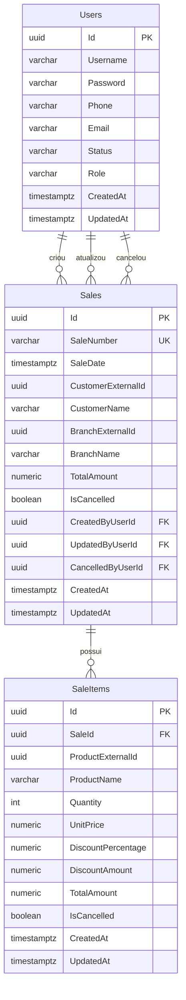

# DeveloperStore Sales API

API do desafio DeveloperStore implementada em .NET 8 com Clean Architecture, DDD, CQRS com MediatR, Entity Framework Core, PostgreSQL, FluentValidation, JWT Bearer, Serilog, Swagger/OpenAPI em portugues, Docker, Seq, Datadog Agent, HashiCorp Vault local para segredos de Development, Redis opcional, OpenTelemetry, Prometheus, Grafana e k6.

Este README foi escrito para o avaliador clonar o repositorio e inicializar a API do zero.

## Sumario

- [O que esta implementado](#o-que-esta-implementado)
- [Pre-requisitos](#pre-requisitos)
- [Inicializacao rapida com Docker](#inicializacao-rapida-com-docker)
- [Migrations](#migrations)
- [Modelagem do banco de dados](#modelagem-do-banco-de-dados)
- [Swagger](#swagger)
- [Fluxo de teste por curl](#fluxo-de-teste-por-curl)
- [Rodar sem container para a API](#rodar-sem-container-para-a-api)
- [Testes](#testes)
- [Composicao de dependencias](#composicao-de-dependencias)
- [Ambientes](#ambientes)
- [Segredos e Vault local](#segredos-e-vault-local)
- [reCAPTCHA v3 simulado](#recaptcha-v3-simulado)
- [Observabilidade](#observabilidade)
- [Stack enterprise local](#stack-enterprise-local)
- [Testes de carga com k6](#testes-de-carga-com-k6)
- [Frontend React](#frontend-react)
- [Idiomas do frontend](#idiomas-do-frontend)
- [Troubleshooting](#troubleshooting)

## O que esta implementado

- Auth com JWT.
- Users.
- CRUD completo de Sales.
- Rastreabilidade de vendas por usuario autenticado.
- Relatorio administrativo de vendas por funcionario.
- Cancelamento de venda.
- Cancelamento de item.
- Regras de desconto por quantidade no dominio.
- External Identities com snapshot denormalizado para cliente, filial e produto.
- Eventos de venda registrados em log: `SaleCreated`, `SaleModified`, `SaleCancelled`, `ItemCancelled`.
- PostgreSQL com EF Core migrations no projeto `Ambev.DeveloperEvaluation.ORM`.
- Migrations automaticas no startup da API.
- Health checks: `/health/live`, `/health/ready`, `/health/logging`, `/health/cache`, `/health/metrics`, `/health/enterprise`.
- Endpoint Prometheus: `/metrics`.
- Swagger em portugues.
- FluentValidation em requests, commands e queries.
- CorrelationId via header `X-Correlation-Id`.
- Logs estruturados com Serilog.
- Seq local em `http://localhost:5341`.
- Datadog Agent configurado via Docker.
- Vault local em modo dev para segredos de Development.
- Redis opcional para cache de leitura no profile enterprise.
- Prometheus, Grafana, postgres-exporter e redis-exporter opcionais no profile enterprise.
- k6 opcional no profile loadtest.
- IoC centralizado em `src/Ambev.DeveloperEvaluation.IoC/ModuleInitializers`.
- Separacao de ambientes: `Development`, `Uat` e `Production`.
- reCAPTCHA v3 simulado para login e criacao de usuario, desabilitado por padrao em Development.
- Frontend React com seletor de idioma em `PT-BR`, `EN` e `ES`.

Fora do escopo desta prova: Azure Service Bus real, Azure Functions reais, Azure Key Vault real e blue-green real.

## Pre-requisitos

Instale:

- Git.
- Docker Desktop com Docker Compose.
- .NET SDK 8.
- PowerShell.

Confira as versoes:

```powershell
git --version
docker --version
docker compose version
dotnet --version
```

Instale o Entity Framework CLI se ainda nao existir:

```powershell
dotnet tool install --global dotnet-ef
dotnet ef --version
```

## Clone e pasta do backend

```powershell
git clone <URL_DO_REPOSITORIO>
cd mouts-challenge\template\backend
git checkout develop
```

Se o repositorio ja estiver clonado nesta maquina:

```powershell
cd C:\Users\Giovani\source\repos\mouts-challenge\template\backend
git checkout develop
```

## Inicializacao rapida com Docker

Este e o fluxo recomendado para avaliar o projeto.

### 1. Limpar execucoes antigas

Use este comando quando quiser iniciar realmente do zero. Ele remove containers e volumes locais do projeto, incluindo banco local e dados do Seq.

```powershell
docker compose down --volumes --remove-orphans
```

### 2. Subir infraestrutura local

```powershell
docker compose up -d ambev.developerevaluation.database vault seq
```

Servicos esperados:

- PostgreSQL: `localhost:5432`
- Vault dev: `http://localhost:8200`
- Seq: `http://localhost:5341`

### 3. Popular segredos no Vault local

PowerShell:

```powershell
$env:VAULT_ADDR="http://localhost:8200"
$env:VAULT_TOKEN="dev-root-token"
.\scripts\vault-init-dev.ps1
```

Linux/macOS:

```bash
export VAULT_ADDR=http://localhost:8200
export VAULT_TOKEN=dev-root-token
./scripts/vault-init-dev.sh
```

O script usa o Vault CLI se estiver instalado. Se nao estiver, ele executa o comando pelo container `developerstore-vault`.

### 4. Subir a WebApi

Ao iniciar, a API espera o PostgreSQL ficar saudavel, valida a conexao com o banco e aplica automaticamente migrations pendentes. Se for a primeira execucao, as tabelas sao criadas nesse momento.

```powershell
docker compose up --build -d ambev.developerevaluation.webapi
```

### 5. Verificar containers

```powershell
docker compose ps
```

### 6. Conferir logs de migrations na primeira subida

```powershell
docker logs --tail 100 ambev_developer_evaluation_webapi
```

Devem aparecer pelo menos:

- `ambev_developer_evaluation_webapi`
- `ambev_developer_evaluation_database`
- `developerstore-vault`
- `developerstore_seq`

O Datadog Agent e opcional para a prova local. Para subi-lo tambem:

```powershell
docker compose up -d datadog-agent
```

## Migrations

Projeto de migrations:

```text
src/Ambev.DeveloperEvaluation.ORM
```

Startup project:

```text
src/Ambev.DeveloperEvaluation.WebApi
```

Normalmente nao e necessario aplicar migrations manualmente em Development, porque a API confere e aplica migrations pendentes na inicializacao. O comando manual abaixo continua util para diagnostico ou manutencao:

```powershell
$env:ASPNETCORE_ENVIRONMENT="Development"
dotnet ef database update --project src/Ambev.DeveloperEvaluation.ORM --startup-project src/Ambev.DeveloperEvaluation.WebApi
```

Connection string local usada pelo host:

```text
Host=localhost;Port=5432;Database=developer_evaluation;Username=developerstore_app;Password=DevOnly_Pg_9fR!42sL#2026_Strong
```

Connection string usada dentro do Docker:

```text
Host=ambev.developerevaluation.database;Port=5432;Database=developer_evaluation;Username=developerstore_app;Password=DevOnly_Pg_9fR!42sL#2026_Strong
```

## Modelagem do banco de dados

A modelagem atual usa PostgreSQL com Entity Framework Core. O `DefaultContext` possui tres agregados persistidos:

```text
src/Ambev.DeveloperEvaluation.ORM/DefaultContext.cs

DbSet<User> Users
DbSet<Sale> Sales
DbSet<SaleItem> SaleItems
```

Mapeamentos EF Core confirmados:

```text
src/Ambev.DeveloperEvaluation.ORM/Mapping/BaseEntityConfigurationExtensions.cs
src/Ambev.DeveloperEvaluation.ORM/Mapping/UserConfiguration.cs
src/Ambev.DeveloperEvaluation.ORM/Mapping/SaleConfiguration.cs
src/Ambev.DeveloperEvaluation.ORM/Mapping/SaleItemConfiguration.cs
```

Todas as entidades persistidas herdam de `BaseEntity` e usam o mesmo mapeamento comum:

```text
Id uuid PK default gen_random_uuid()
CreatedAt timestamp with time zone not null
UpdatedAt timestamp with time zone null
```

### Visao relacional



### Correlacoes entre dominio e banco

| Dominio | Tabela | Relacionamento | Observacao |
| --- | --- | --- | --- |
| `User` | `Users` | FK operacional em `Sales` | Usado por Auth/Users. A venda registra usuario criador, ultimo atualizador e cancelador. |
| `Sale` | `Sales` | Raiz do agregado | Armazena cabecalho da venda, snapshots de cliente/filial e usuarios responsaveis. |
| `SaleItem` | `SaleItems` | `SaleItems.SaleId -> Sales.Id` | Itens pertencem a uma venda. O delete da venda remove os itens por cascade. |
| Customer externo | Colunas em `Sales` | Sem tabela local | `CustomerExternalId` e `CustomerName` sao snapshot denormalizado. |
| Branch externa | Colunas em `Sales` | Sem tabela local | `BranchExternalId` e `BranchName` sao snapshot denormalizado. |
| Product externo | Colunas em `SaleItems` | Sem tabela local | `ProductExternalId` e `ProductName` sao snapshot denormalizado. |
| Eventos de dominio | Nao persistidos | Sem tabela | `SaleCreated`, `SaleModified`, `SaleCancelled` e `ItemCancelled` sao registrados em log estruturado. |

### Users

Tabela de usuarios usada por Auth e Users. O mapeamento EF converte `Status` e `Role` para string no banco.

```text
Users
-----
Id uuid PK default gen_random_uuid()
Username varchar(50) not null
Password varchar(100) not null
Phone varchar(20) not null
Email varchar(100) not null
Status varchar(20) not null
Role varchar(20) not null
CreatedAt timestamp with time zone not null
UpdatedAt timestamp with time zone null
```

Mapeamento:

```text
User.Id        -> Users.Id
User.Username  -> Users.Username
User.Password  -> Users.Password
User.Phone     -> Users.Phone
User.Email     -> Users.Email
User.Status    -> Users.Status, enum convertido para string
User.Role      -> Users.Role, enum convertido para string
User.CreatedAt -> Users.CreatedAt
User.UpdatedAt -> Users.UpdatedAt
```

### Sales

Tabela principal do agregado de vendas.

```text
Sales
-----
Id uuid PK default gen_random_uuid()
SaleNumber varchar(60) not null unique
SaleDate timestamp with time zone not null
CustomerExternalId uuid not null
CustomerName varchar(120) not null
BranchExternalId uuid not null
BranchName varchar(120) not null
TotalAmount numeric(18,2) not null
IsCancelled boolean not null
CreatedByUserId uuid FK -> Users.Id not null
UpdatedByUserId uuid FK -> Users.Id null
CancelledByUserId uuid FK -> Users.Id null
CreatedAt timestamp with time zone not null
UpdatedAt timestamp with time zone null
```

Indices:

```text
IX_Sales_SaleNumber unique
IX_Sales_CustomerExternalId
IX_Sales_BranchExternalId
IX_Sales_SaleDate
IX_Sales_IsCancelled
IX_Sales_CreatedByUserId
IX_Sales_UpdatedByUserId
IX_Sales_CancelledByUserId
```

Mapeamento:

```text
Sale.Id                 -> Sales.Id
Sale.SaleNumber         -> Sales.SaleNumber
Sale.SaleDate           -> Sales.SaleDate
Sale.CustomerExternalId -> Sales.CustomerExternalId
Sale.CustomerName       -> Sales.CustomerName
Sale.BranchExternalId   -> Sales.BranchExternalId
Sale.BranchName         -> Sales.BranchName
Sale.TotalAmount        -> Sales.TotalAmount
Sale.IsCancelled        -> Sales.IsCancelled
Sale.CreatedByUserId    -> Sales.CreatedByUserId
Sale.UpdatedByUserId    -> Sales.UpdatedByUserId
Sale.CancelledByUserId  -> Sales.CancelledByUserId
Sale.CreatedAt          -> Sales.CreatedAt
Sale.UpdatedAt          -> Sales.UpdatedAt
Sale.Items              -> SaleItems via SaleItems.SaleId
Sale.DomainEvents       -> ignorado pelo EF, nao vira coluna
```

### SaleItems

Tabela de itens da venda.

```text
SaleItems
---------
Id uuid PK default gen_random_uuid()
SaleId uuid FK -> Sales.Id not null
ProductExternalId uuid not null
ProductName varchar(120) not null
Quantity integer not null
UnitPrice numeric(18,2) not null
DiscountPercentage numeric(5,2) not null
DiscountAmount numeric(18,2) not null
TotalAmount numeric(18,2) not null
IsCancelled boolean not null
CreatedAt timestamp with time zone not null
UpdatedAt timestamp with time zone null
```

Indices:

```text
IX_SaleItems_SaleId
IX_SaleItems_ProductExternalId
```

Mapeamento:

```text
SaleItem.Id                 -> SaleItems.Id
SaleItem.SaleId             -> SaleItems.SaleId
SaleItem.ProductExternalId  -> SaleItems.ProductExternalId
SaleItem.ProductName        -> SaleItems.ProductName
SaleItem.Quantity           -> SaleItems.Quantity
SaleItem.UnitPrice          -> SaleItems.UnitPrice
SaleItem.DiscountPercentage -> SaleItems.DiscountPercentage
SaleItem.DiscountAmount     -> SaleItems.DiscountAmount
SaleItem.TotalAmount        -> SaleItems.TotalAmount
SaleItem.IsCancelled        -> SaleItems.IsCancelled
SaleItem.CreatedAt          -> SaleItems.CreatedAt
SaleItem.UpdatedAt          -> SaleItems.UpdatedAt
```

Relacionamento:

```text
Sales 1:N SaleItems
SaleItems.SaleId -> Sales.Id
DeleteBehavior: Cascade
Users 1:N Sales por Sales.CreatedByUserId
Users 1:N Sales por Sales.UpdatedByUserId
Users 1:N Sales por Sales.CancelledByUserId
DeleteBehavior de Users para Sales: Restrict
```

Observacoes importantes:

- `Users` possui relacionamento operacional com `Sales` para rastrear criacao, ultima atualizacao e cancelamento.
- Nao existem tabelas `Customers`, `Branches` ou `Products`.
- Sales usa snapshot denormalizado por external identity: `CustomerExternalId`, `CustomerName`, `BranchExternalId`, `BranchName`, `ProductExternalId` e `ProductName`.
- Eventos de dominio existem no dominio, mas nao sao persistidos em tabela.
- Cache Redis, metricas, logs, health checks e reCAPTCHA nao criam tabelas nesta implementacao.

Prompt pronto para gerar um DER:

```text
Desenhe um DER/ERD para um banco PostgreSQL com as tabelas Users, Sales e SaleItems.

Users possui:
Id uuid PK, Username varchar(50), Password varchar(100), Phone varchar(20), Email varchar(100), Status varchar(20), Role varchar(20), CreatedAt timestamptz, UpdatedAt timestamptz nullable.

Sales possui:
Id uuid PK, SaleNumber varchar(60) unique, SaleDate timestamptz, CustomerExternalId uuid, CustomerName varchar(120), BranchExternalId uuid, BranchName varchar(120), TotalAmount numeric(18,2), IsCancelled boolean, CreatedByUserId uuid FK para Users.Id, UpdatedByUserId uuid nullable FK para Users.Id, CancelledByUserId uuid nullable FK para Users.Id, CreatedAt timestamptz, UpdatedAt timestamptz nullable.

SaleItems possui:
Id uuid PK, SaleId uuid FK para Sales.Id, ProductExternalId uuid, ProductName varchar(120), Quantity integer, UnitPrice numeric(18,2), DiscountPercentage numeric(5,2), DiscountAmount numeric(18,2), TotalAmount numeric(18,2), IsCancelled boolean, CreatedAt timestamptz, UpdatedAt timestamptz nullable.

Relacionamento:
Sales 1:N SaleItems, com cascade delete.
Users 1:N Sales por CreatedByUserId, UpdatedByUserId e CancelledByUserId, com delete restrict.

Observacoes:
Users se relaciona com Sales para rastrear qual usuario criou, atualizou ou cancelou cada venda.
Nao existem tabelas Customer, Branch ou Product.
Sales guarda snapshots denormalizados de cliente, filial e produto atraves de ExternalId e Name.
```

## Health checks

Com a API no Docker:

```powershell
curl.exe -i http://localhost:8080/health/live
curl.exe -i http://localhost:8080/health/ready
curl.exe -i http://localhost:8080/health/logging
curl.exe -i http://localhost:8080/health/cache
curl.exe -i http://localhost:8080/health/metrics
curl.exe -i http://localhost:8080/health/enterprise
```

Resultado esperado:

- `/health/live`: `200 OK`, processo vivo.
- `/health/ready`: `200 OK`, API pronta e PostgreSQL/configuracoes essenciais OK.
- `/health/logging`: `200 OK`, configuracao de logs sem expor segredo.
- `/health/cache`: `200 OK`, status seguro do cache. Com `Cache:Enabled=false`, informa cache desabilitado.
- `/health/metrics`: `200 OK`, status seguro das metricas.
- `/health/enterprise`: `200 OK`, status seguro da stack local: Seq, Redis, Prometheus, Grafana e Datadog.

Metricas Prometheus:

```powershell
curl.exe -i http://localhost:8080/metrics
```

## Swagger

Com Docker:

```text
http://localhost:8080/swagger
```

Com `dotnet run` local:

```text
http://localhost:5119/swagger
```

No Swagger:

1. Crie um usuario em `POST /api/Users`.
2. Autentique em `POST /api/Auth`.
3. Copie o token retornado.
4. Clique em `Authorize`.
5. Informe `Bearer <TOKEN>`.
6. Teste os endpoints de Sales.

## Fluxo de teste por curl

Os exemplos abaixo usam PowerShell e `curl.exe`.

### 1. Criar usuario admin

```powershell
curl.exe -i -X POST http://localhost:8080/api/Users `
  -H "Content-Type: application/json" `
  -H "X-Correlation-Id: 11111111-1111-1111-1111-111111111111" `
  -d '{\"username\":\"Admin DeveloperStore\",\"password\":\"Senha@123456\",\"phone\":\"11999999999\",\"email\":\"admin@developerstore.com\",\"status\":1,\"role\":3}'
```

Valores confirmados nos enums do projeto:

- `status: 1` = `Active`
- `role: 3` = `Admin`

### 2. Autenticar

```powershell
curl.exe -i -X POST http://localhost:8080/api/Auth `
  -H "Content-Type: application/json" `
  -d '{\"email\":\"admin@developerstore.com\",\"password\":\"Senha@123456\"}'
```

Copie o token retornado em `data.token`.

```powershell
$TOKEN="<COLE_AQUI_O_TOKEN>"
```

### 3. Criar venda

```powershell
curl.exe -i -X POST http://localhost:8080/api/sales `
  -H "Content-Type: application/json" `
  -H "Authorization: Bearer $TOKEN" `
  -H "X-Correlation-Id: 22222222-2222-2222-2222-222222222222" `
  -d '{\"saleNumber\":\"SALE-2026-000001\",\"saleDate\":\"2026-05-26T14:30:00Z\",\"customerExternalId\":\"5c9d7b1e-2a63-4e69-9c55-4c0e8142f8c1\",\"customerName\":\"Joao da Silva\",\"branchExternalId\":\"7a2b2c71-6c2e-4f54-8a7e-32159a4d53e2\",\"branchName\":\"Loja Centro - Sao Paulo\",\"items\":[{\"productExternalId\":\"33a8b4f9-4a6e-49c9-91df-ec7b40b3b1a1\",\"productName\":\"Camiseta DeveloperStore\",\"quantity\":4,\"unitPrice\":50.00},{\"productExternalId\":\"e7cb8e84-2c77-4020-bf2a-74cfce2b67cb\",\"productName\":\"Caneca DeveloperStore\",\"quantity\":10,\"unitPrice\":25.00}]}'
```

Calculo esperado:

- Camiseta: `4 * 50.00 = 200.00`, desconto 10%, total `180.00`.
- Caneca: `10 * 25.00 = 250.00`, desconto 20%, total `200.00`.
- Total da venda: `380.00`.

### 4. Listar vendas

```powershell
curl.exe -i "http://localhost:8080/api/sales?page=1&pageSize=20" `
  -H "Authorization: Bearer $TOKEN"
```

Com filtros:

```powershell
curl.exe -i "http://localhost:8080/api/sales?page=1&pageSize=20&isCancelled=false&fromDate=2026-01-01&toDate=2026-12-31" `
  -H "Authorization: Bearer $TOKEN"
```

### 5. Consultar venda por id

Substitua `<SALE_ID>` pelo `data.id` retornado na criacao.

```powershell
curl.exe -i http://localhost:8080/api/sales/<SALE_ID> `
  -H "Authorization: Bearer $TOKEN"
```

### 5.1 Relatorio administrativo de vendas por usuario

Disponivel apenas para usuarios com role `Admin`.

```powershell
curl.exe -i "http://localhost:8080/api/sales/reports/by-user" `
  -H "Authorization: Bearer $TOKEN"
```

Com periodo:

```powershell
curl.exe -i "http://localhost:8080/api/sales/reports/by-user?fromDate=2026-01-01&toDate=2026-12-31" `
  -H "Authorization: Bearer $TOKEN"
```

O relatorio retorna, por usuario:

- identificador, nome, e-mail e perfil;
- total de vendas realizadas;
- vendas confirmadas;
- vendas canceladas;
- valor total vendido;
- primeira e ultima data de venda no periodo.

### 6. Atualizar venda

```powershell
curl.exe -i -X PUT http://localhost:8080/api/sales/<SALE_ID> `
  -H "Content-Type: application/json" `
  -H "Authorization: Bearer $TOKEN" `
  -d '{\"saleNumber\":\"SALE-2026-000001\",\"saleDate\":\"2026-05-26T15:00:00Z\",\"customerExternalId\":\"5c9d7b1e-2a63-4e69-9c55-4c0e8142f8c1\",\"customerName\":\"Joao da Silva\",\"branchExternalId\":\"7a2b2c71-6c2e-4f54-8a7e-32159a4d53e2\",\"branchName\":\"Loja Centro - Sao Paulo\",\"items\":[{\"productExternalId\":\"33a8b4f9-4a6e-49c9-91df-ec7b40b3b1a1\",\"productName\":\"Camiseta DeveloperStore\",\"quantity\":9,\"unitPrice\":50.00}]}'
```

### 7. Cancelar item da venda

Substitua `<ITEM_ID>` pelo id do item retornado na venda.

```powershell
curl.exe -i -X PATCH http://localhost:8080/api/sales/<SALE_ID>/items/<ITEM_ID>/cancel `
  -H "Authorization: Bearer $TOKEN"
```

Item cancelado nao compoe o total financeiro da venda.

### 8. Cancelar venda

```powershell
curl.exe -i -X PATCH http://localhost:8080/api/sales/<SALE_ID>/cancel `
  -H "Authorization: Bearer $TOKEN"
```

Venda cancelada nao permite novas alteracoes de itens.

### 9. Remover venda

```powershell
curl.exe -i -X DELETE http://localhost:8080/api/sales/<SALE_ID> `
  -H "Authorization: Bearer $TOKEN"
```

`DELETE` remove fisicamente. Cancelamento comercial e feito em `PATCH /api/sales/{id}/cancel`.

## Regras de negocio de Sales

- 1 a 3 unidades do mesmo produto: 0% de desconto.
- 4 a 9 unidades do mesmo produto: 10% de desconto.
- 10 a 20 unidades do mesmo produto: 20% de desconto.
- Acima de 20 unidades do mesmo produto: operacao invalida.
- Produto duplicado na mesma venda nao e permitido.
- Item cancelado nao entra no total da venda.
- Venda cancelada nao permite alteracao de itens.
- Desconto manual nao e aceito no request.

## Rodar sem container para a API

Suba somente a infraestrutura:

```powershell
docker compose up -d ambev.developerevaluation.database vault seq
```

Popule o Vault:

```powershell
$env:VAULT_ADDR="http://localhost:8200"
$env:VAULT_TOKEN="dev-root-token"
.\scripts\vault-init-dev.ps1
```

Opcionalmente, aplique migrations manualmente para diagnostico. A API tambem aplica migrations pendentes no startup:

```powershell
$env:ASPNETCORE_ENVIRONMENT="Development"
dotnet ef database update --project src/Ambev.DeveloperEvaluation.ORM --startup-project src/Ambev.DeveloperEvaluation.WebApi
```

Rode a API:

```powershell
$env:ASPNETCORE_ENVIRONMENT="Development"
dotnet run --project src/Ambev.DeveloperEvaluation.WebApi
```

Abra:

```text
http://localhost:5119/swagger
```

## Testes

Comandos:

```powershell
dotnet restore .\Ambev.DeveloperEvaluation.sln
dotnet build .\Ambev.DeveloperEvaluation.sln --configuration Release --no-restore
dotnet test .\Ambev.DeveloperEvaluation.sln --configuration Release --no-build
```

Estado atual do projeto:

- `tests/Ambev.DeveloperEvaluation.Unit` contem testes unitarios.
- A validacao recente da branch `develop` executou 101 testes unitarios com sucesso.
- `tests/Ambev.DeveloperEvaluation.Functional` e `tests/Ambev.DeveloperEvaluation.Integration` existem na solution, mas podem aparecer sem testes descobertos.

## Composicao de dependencias

A composicao da aplicacao fica centralizada no projeto `src/Ambev.DeveloperEvaluation.IoC`.

Arquivos principais:

```text
src/Ambev.DeveloperEvaluation.IoC/DependencyResolver.cs
src/Ambev.DeveloperEvaluation.IoC/ModuleInitializers/ApplicationModuleInitializer.cs
src/Ambev.DeveloperEvaluation.IoC/ModuleInitializers/InfrastructureModuleInitializer.cs
```

Responsabilidades atuais:

- `ApplicationModuleInitializer`: registra MediatR, AutoMapper, FluentValidation, pipeline behaviors e servicos de aplicacao.
- `InfrastructureModuleInitializer`: registra `DefaultContext`, repositories, cache, invalidacao de cache, metricas e OpenTelemetry.
- `WebApiServiceExtensions`: mantem configuracoes HTTP da WebApi, como controllers, endpoints, Swagger, CORS, rate limiting, JWT, authorization, health checks e middlewares.

O `Program.cs` permanece limpo e restrito ao bootstrap: carregar configuracoes, montar a aplicacao, aplicar migrations pendentes e iniciar o host.

## Ambientes

### Development

Arquivo:

```text
src/Ambev.DeveloperEvaluation.WebApi/appsettings.Development.json
```

Caracteristicas:

- Swagger habilitado.
- Detailed errors habilitados.
- Vault local opcional.
- Fallback controlado para appsettings/env vars.
- CORS local.
- Seq habilitado.

Rodar:

```powershell
$env:ASPNETCORE_ENVIRONMENT="Development"
dotnet run --project src/Ambev.DeveloperEvaluation.WebApi
```

### UAT

Arquivo:

```text
src/Ambev.DeveloperEvaluation.WebApi/appsettings.Uat.json
```

Rodar:

```powershell
$env:ASPNETCORE_ENVIRONMENT="Uat"
dotnet run --project src/Ambev.DeveloperEvaluation.WebApi
```

UAT usa valores fortes de simulacao para a prova. Em ambiente real, sobrescreva segredos por variaveis de ambiente.

### Production

Arquivo:

```text
src/Ambev.DeveloperEvaluation.WebApi/appsettings.Production.json
```

Production nao possui segredo real commitado. Para simular localmente, configure variaveis:

```powershell
$env:ASPNETCORE_ENVIRONMENT="Production"
$env:ConnectionStrings__DefaultConnection="Host=prod-postgres.internal;Port=5432;Database=developerstore;Username=prod_app;Password=Prod_Strong_9gT!41pL#2026"
$env:Jwt__SecretKey="Prod_JwtSecret_2026_pZ9!mQ4#vL8@rT2%DeveloperStore"
$env:Jwt__Issuer="DeveloperStore.Production"
$env:Jwt__Audience="DeveloperStore.Api"
$env:Security__AllowedOrigins__0="https://developerstore.example.com"
dotnet run --project src/Ambev.DeveloperEvaluation.WebApi
```

Se faltar segredo obrigatorio ou houver valor fraco/local, a API falha no startup de proposito.

## Segredos e Vault local

Vault local:

```text
http://localhost:8200
```

Token dev:

```text
dev-root-token
```

Caminho dos segredos:

```text
secret/developerstore/development
```

Valores gravados pelo script:

```text
Jwt__SecretKey=DevOnly_JwtSecret_2026_pZ9!mQ4#vL8@rT2%DeveloperStore
Jwt__Issuer=DeveloperStore.Development
Jwt__Audience=DeveloperStore.Api
ConnectionStrings__DefaultConnection=Host=ambev.developerevaluation.database;Port=5432;Database=developer_evaluation;Username=developerstore_app;Password=DevOnly_Pg_9fR!42sL#2026_Strong
```

Consultar o Vault via container:

```powershell
docker exec -e VAULT_ADDR=http://127.0.0.1:8200 -e VAULT_TOKEN=dev-root-token developerstore-vault vault kv get secret/developerstore/development
```

Estes valores sao somente para prova de conceito local.

## Observabilidade

## reCAPTCHA v3 simulado

A prova inclui protecao anti-bot em modo simulado, sem Google real, sem chave real, sem internet e sem servico externo.

Endpoints protegidos quando `Recaptcha__Enabled=true`:

- `POST /api/Auth`
- `POST /api/Users`

Por padrao em Development a protecao fica desabilitada para facilitar a avaliacao:

```powershell
$env:RECAPTCHA_ENABLED="false"
$env:VITE_RECAPTCHA_ENABLED="false"
docker compose up --build -d
```

Para demonstrar a protecao simulada no Docker:

```powershell
$env:RECAPTCHA_ENABLED="true"
$env:VITE_RECAPTCHA_ENABLED="true"
docker compose up --build -d ambev.developerevaluation.webapi frontend
```

Formato do token simulado:

```text
simulated:{action}:{unixTimestampSeconds}:{nonce}
```

Actions usadas:

- Login: `login`
- Criacao de usuario: `create_user`

O frontend gera o token apenas no submit e nao salva em `localStorage`. O backend valida prefixo, action, expiracao e score simulado. Para simular falha:

```powershell
$env:RECAPTCHA_ENABLED="true"
$env:Recaptcha__Simulated__ForceFailure="true"
$env:VITE_RECAPTCHA_ENABLED="true"
docker compose up --build -d ambev.developerevaluation.webapi frontend
```

Documentacao detalhada: [reCAPTCHA simulado](docs/security-recaptcha.md).

Seq:

```text
http://localhost:5341
```

Datadog Agent:

```powershell
docker compose up -d datadog-agent
```

Para enviar logs reais ao Datadog, crie um `.env` baseado em `.env.example`:

```text
DD_API_KEY=coloque_sua_api_key_datadog_aqui
DD_SITE=datadoghq.com
DD_ENV=development
DD_SERVICE=developerstore-sales-api
DD_VERSION=1.0.0
```

Sem `DD_API_KEY` real, a API continua funcionando e Seq continua sendo o fallback local pesquisavel.

Pesquisas uteis no Seq:

```text
correlationId = '22222222-2222-2222-2222-222222222222'
requestPath like '%sales%'
saleNumber = 'SALE-2026-000001'
```

## Stack enterprise local

O modo simples continua funcionando com:

```powershell
docker compose up --build -d
```

No modo simples, tambem existe container do Datadog Agent no compose. Ele nao e obrigatorio para a API funcionar; sem `DD_API_KEY` real, os logs continuam disponiveis no console e no Seq.

O modo enterprise local adiciona Redis, Prometheus, Grafana, postgres-exporter e redis-exporter. Para ativar cache Redis na API, defina `CACHE_ENABLED=true` antes de subir a stack:

```powershell
$env:CACHE_ENABLED="true"
docker compose --profile enterprise up --build -d
```

Validar endpoints:

```powershell
curl.exe -i http://localhost:8080/health/cache
curl.exe -i http://localhost:8080/health/metrics
curl.exe -i http://localhost:8080/metrics
```

URLs:

```text
Prometheus: http://localhost:9090
Grafana:    http://localhost:3000
Redis:      localhost:6379
```

Grafana local:

```text
usuario: admin
senha:   developerstore
```

Dashboards provisionados:

- DeveloperStore API.
- DeveloperStore Sales.
- DeveloperStore Cache.
- DeveloperStore PostgreSQL.

Cache Redis:

- Cacheia `GET /api/sales/{id}`.
- Cacheia `GET /api/sales`.
- Escritas invalidam detalhe da venda e incrementam a versao das listas.
- Se Redis falhar, a API consulta PostgreSQL e registra warning.

Para desligar o cache e voltar ao modo simples:

```powershell
Remove-Item Env:\CACHE_ENABLED -ErrorAction SilentlyContinue
docker compose up --build -d
```

## Testes de carga com k6

Scripts:

```text
tests/load/k6-smoke.js
tests/load/k6-sales-read.js
tests/load/k6-sales-write.js
tests/load/k6-sales-mixed.js
```

Rodar smoke:

```powershell
docker compose --profile loadtest run --rm k6 run /scripts/k6-smoke.js
```

Rodar leitura:

```powershell
docker compose --profile loadtest run --rm k6 run /scripts/k6-sales-read.js
```

Rodar misto com token JWT:

```powershell
$env:K6_TOKEN="<TOKEN_JWT>"
docker compose --profile loadtest run --rm k6 run /scripts/k6-sales-mixed.js
```

Variaveis:

- `K6_BASE_URL`: URL base da API. Padrao no Docker: `http://ambev.developerevaluation.webapi:8080`.
- `K6_TOKEN`: token JWT para endpoints protegidos.
- `K6_SALE_ID`: id de venda para teste de detalhe.

## Frontend React

O projeto frontend fica em:

```text
template/frontend
```

Stack usada:

- React, TypeScript e Vite.
- React Router para rotas publicas e protegidas.
- TanStack Query para server state, cache e invalidacao de Sales.
- React Hook Form + Zod para formularios e validacoes.
- Tailwind CSS com componentes no estilo shadcn/ui.
- Motion for React para transicoes suaves.
- Axios com client tipado, JWT Bearer e `X-Correlation-Id`.
- Sonner para notificacoes.
- Lucide React para icones.
- Seletor de idioma com `PT-BR`, `EN` e `ES`.

Rodar backend:

```powershell
cd C:\Users\Giovani\source\repos\mouts-challenge\template\backend
docker compose up --build -d
```

Rodar frontend:

```powershell
cd C:\Users\Giovani\source\repos\mouts-challenge\template\frontend
Copy-Item .env.example .env
npm install
npm run dev
```

Rodar frontend via Docker Compose:

```powershell
cd C:\Users\Giovani\source\repos\mouts-challenge\template\backend
docker compose up --build -d frontend
```

Abrir:

```text
http://localhost:5173
```

Login rápido pelo botão demo:

1. Acesse `http://localhost:5173/`.
2. Na tela de login, clique em `Usar demo`.
3. O formulário será preenchido com:

```text
E-mail: admin@developerstore.com
Senha:  Senha@123456
```

4. Clique em `Entrar`.
5. Após autenticar, o frontend abre o painel e passa a enviar o JWT automaticamente nas chamadas protegidas.

Variaveis do frontend:

```text
VITE_API_BASE_URL=http://localhost:8080
VITE_APP_NAME=DeveloperStore Frontend
VITE_APP_ENV=development
VITE_RECAPTCHA_ENABLED=false
VITE_RECAPTCHA_PROVIDER=simulated
VITE_RECAPTCHA_LOGIN_ACTION=login
VITE_RECAPTCHA_CREATE_USER_ACTION=create_user
```

Comandos:

```powershell
npm run lint
npm run build
npm run preview
```

Telas implementadas:

- `/login`: autenticacao via `POST /api/Auth`.
- `/dashboard`: indicadores calculados sobre a pagina de vendas carregada e status da API.
- `/sales`: listagem, filtros e paginacao.
- `/sales/new`: criacao de venda.
- `/sales/reports/users`: relatorio administrativo de vendas por funcionario, visivel no menu para usuarios `Admin`.
- `/sales/{id}`: detalhes, cancelamento de venda, cancelamento de item e remocao.
- `/sales/{id}/edit`: edicao de venda ativa.
- `/users/new`: criacao de usuario.
- `/health`: consulta `/health/live`, `/health/ready`, `/health/logging`, `/health/cache` e `/health/metrics`.

Fluxo de avaliacao:

1. Suba o backend com Docker.
2. Rode o frontend em `http://localhost:5173`.
3. Na tela de login, clique em `Usar demo` e depois em `Entrar`.
4. Se preferir, crie usuario pelo Swagger ou pela tela de usuario quando autenticado e autentique em `/login`.
5. Crie, liste, filtre, edite, detalhe, cancele item, cancele venda e remova venda.
6. Consulte dashboard e health page.

O backend ja permite CORS para `http://localhost:5173` em Development.

## Idiomas do frontend

O frontend possui uma barra de idioma visivel na tela de login e no topo da area autenticada.

Idiomas disponiveis:

```text
PT-BR: portugues do Brasil
EN: ingles
ES: espanhol
```

Implementacao:

```text
../frontend/src/shared/components/layout/LanguageSelector.tsx
../frontend/src/shared/i18n/translations.ts
../frontend/src/shared/i18n/language-context.tsx
../frontend/src/shared/i18n/use-language.ts
```

Comportamento:

- O idioma padrao e `PT-BR`.
- A selecao fica salva no `localStorage` com a chave `developerstore.language`.
- O seletor altera textos do menu, login, dashboard, health, usuarios, vendas, validacoes, mensagens de erro e notificacoes.
- O backend continua expondo a API em portugues no Swagger; a troca de idioma e uma responsabilidade do frontend.

Mapeamento visual:

| Botao | Idioma aplicado |
| --- | --- |
| `PT-BR` | Portugues do Brasil |
| `EN` | Ingles |
| `ES` | Espanhol |

Para validar:

1. Acesse `http://localhost:5173`.
2. Use a barra no canto superior direito da tela.
3. Clique em `EN` para exibir a interface em ingles.
4. Clique em `ES` para exibir a interface em espanhol.
5. Clique em `PT-BR` para voltar ao portugues.

## Estrutura principal

```text
src/Ambev.DeveloperEvaluation.WebApi
src/Ambev.DeveloperEvaluation.Application
src/Ambev.DeveloperEvaluation.Domain
src/Ambev.DeveloperEvaluation.ORM
src/Ambev.DeveloperEvaluation.Common
src/Ambev.DeveloperEvaluation.IoC
src/Ambev.DeveloperEvaluation.IoC/ModuleInitializers
../frontend
../frontend/src/features
tests/Ambev.DeveloperEvaluation.Unit
tests/Ambev.DeveloperEvaluation.Functional
tests/Ambev.DeveloperEvaluation.Integration
tests/load
infra/prometheus
infra/grafana
docs
scripts
```

## Documentacao complementar

- [Arquitetura](docs/architecture.md)
- [Ambientes](docs/environments.md)
- [Swagger](docs/swagger.md)
- [Seguranca](docs/security.md)
- [reCAPTCHA simulado](docs/security-recaptcha.md)
- [Segredos](docs/secrets.md)
- [Observabilidade](docs/observability.md)
- [Observabilidade local](docs/observability-local.md)
- [Logs](docs/logging.md)
- [Resiliencia](docs/resilience.md)
- [Cache](docs/cache.md)
- [Performance](docs/performance.md)
- [Testes de carga](docs/load-testing.md)

## Troubleshooting

### PostgreSQL nao aceita usuario/senha

Provavel volume antigo. Reset:

```powershell
docker compose down --volumes --remove-orphans
docker compose up -d ambev.developerevaluation.database vault seq
$env:VAULT_ADDR="http://localhost:8200"
$env:VAULT_TOKEN="dev-root-token"
.\scripts\vault-init-dev.ps1
$env:ASPNETCORE_ENVIRONMENT="Development"
dotnet ef database update --project src/Ambev.DeveloperEvaluation.ORM --startup-project src/Ambev.DeveloperEvaluation.WebApi
docker compose up --build -d ambev.developerevaluation.webapi
```

### Vault nao esta pronto

Rode novamente:

```powershell
.\scripts\vault-init-dev.ps1
```

O script tenta aguardar o Vault antes de gravar os segredos.

### Swagger nao abre

Confira se a API esta viva:

```powershell
docker logs --tail 100 ambev_developer_evaluation_webapi
curl.exe -i http://localhost:8080/health/live
```

### Health ready falha

Veja logs da API:

```powershell
docker logs --tail 200 ambev_developer_evaluation_webapi
```

Verifique se as migrations foram aplicadas:

```powershell
$env:ASPNETCORE_ENVIRONMENT="Development"
dotnet ef database update --project src/Ambev.DeveloperEvaluation.ORM --startup-project src/Ambev.DeveloperEvaluation.WebApi
```

### Erro 401 em Sales

Crie usuario, autentique em `/api/Auth`, copie `data.token` e envie:

```text
Authorization: Bearer <TOKEN>
```

### Erro 403 em Sales

Use usuario com role `Admin` no cadastro:

```json
"role": 3
```

### Porta 8080 ou 5432 ocupada

Verifique containers existentes:

```powershell
docker ps
```

Pare a stack:

```powershell
docker compose down
```

## Links locais

- API Docker: `http://localhost:8080`
- Swagger Docker: `http://localhost:8080/swagger`
- API via `dotnet run`: `http://localhost:5119`
- Swagger via `dotnet run`: `http://localhost:5119/swagger`
- Seq: `http://localhost:5341`
- Vault: `http://localhost:8200`
- PostgreSQL: `localhost:5432`
